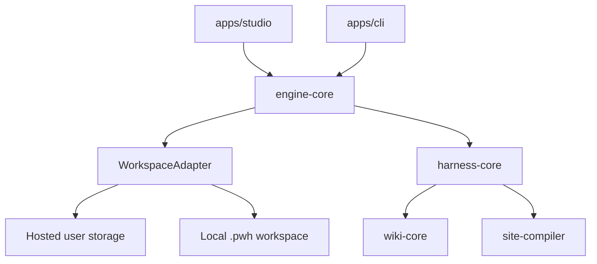

# Architecture

Personal Wiki Harness is not a generic AI website builder. It is a compilation system where a personal wiki is the durable source of meaning and a public or private site is a versioned build artifact.

## Core Thesis

The model is only one component. Everything around it is harness:

- durable state and run history
- wiki and source access
- context selection
- tool registration and authorization
- planning and execution
- verification
- version records
- hooks and middleware

The harness should make long-running site construction inspectable, repeatable, and correctable.

## Layers

1. Raw sources are immutable evidence. They may be ingested, cited, and linked, but never rewritten by the harness.
2. The wiki is the persistent semantic layer. It is maintained incrementally through entity pages, topic pages, source summaries, indexes, logs, relations, and lint issues.
3. The workspace adapter hides where state lives: hosted platform storage for GUI users, or a local `.pwh/` workspace for CLI users.
4. The engine layer exposes user-facing operations such as ingesting sources, maintaining a wiki, creating a build run, compiling a site, and recording versions.
5. The harness runtime is the command layer. It converts a user intent into context, a plan, tool calls, verification, and a build version.
6. The system meta-skill layer stores product-level procedures learned during build testing.
7. The model routing layer assigns strong, balanced, small, or retrieval tiers to runtime roles.
8. The site compiler converts wiki-backed meaning into a content model, design usage plan, site plan, site graph, patch plan, and artifact boundary.
9. Studio and CLI are entry points over the same primitives. They should not own separate build logic.

The website build loop has three product agent roles:

- Conversation Agent: selects the knowledge base and clarifies site intent, audience, style, and hard constraints.
- Builder Agent: reads the selected wiki, uses design asset tools, writes `ContentModel`, `DesignUsagePlan`, `SitePlan`, and the HTML artifact.
- Review Agent: verifies grounding, privacy, design asset refs, public language, and publish readiness.

Harness is the engineering layer underneath those roles. It owns context packets, tool gates, queueing, logs, retries, costs, versions, site workspace, site graph, patch builds, and publishing.

## Package Boundaries

- `wiki-core` owns wiki data shapes and wiki maintenance records.
- `agent-runtime` owns model messages, tool definitions, tool calls, and execution boundaries.
- `meta-skill-core` owns system-level reusable procedures and promotion policy.
- `site-compiler` owns the intermediate site representation, including `DesignUsagePlan` and `SiteGraph`.
- `harness-core` coordinates the other packages without knowing UI details.
- `engine-core` owns the shared GUI/CLI service boundary and workspace adapter contract.
- `apps/studio` is the hosted GUI shell.
- `apps/cli` is the local shell that reads local files by reference and writes `.pwh/`.

The current Studio implementation uses a lightweight file-backed store under `.pwh-studio/` for local development. It persists users, per-user knowledge bases, pending mutation reviews, runs, published versions, and site state. This is intentionally a prototype storage adapter; the object boundaries should map cleanly to a hosted database later.

## GUI And CLI Boundary

The platform and the CLI should both call the same engine:

In hosted mode, uploaded content can be stored inline or in server storage. In local mode, raw files should stay in place by default; the workspace stores references, extracted snippets, wiki pages, logs, build versions, and exported static site files.
