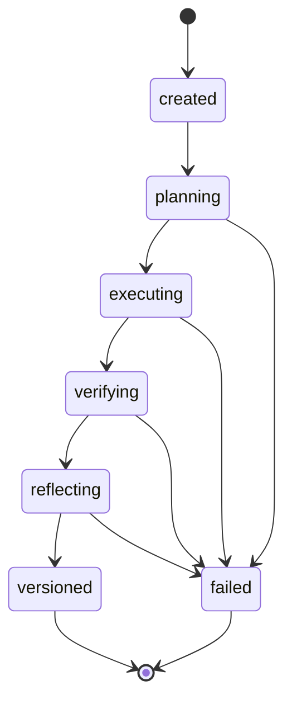

# Build State Machine

Harness runs move through a small explicit state machine.

## States

- `created`: intent has been captured.
- `planning`: context is assembled and a plan is produced.
- `executing`: plan steps are being applied.
- `verifying`: outputs are checked.
- `reflecting`: run quality, model routing, and possible system-skill evidence are recorded.
- `versioned`: a build version exists.
- `failed`: the run stopped with a recorded error.

The state machine is intentionally small. Richness belongs in the ledger, plan, tool records, and verification details.
