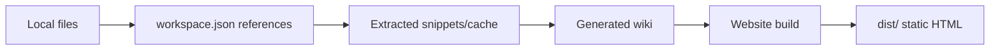

# Local Workspace

The local CLI should not turn a user's computer into an upload bucket. It should keep raw files where they already live and build a compact, durable workspace around them.

This follows the LLM Wiki pattern:

- raw sources are immutable evidence
- the wiki is the maintained semantic layer
- `index.wiki` is the content map
- `log.wiki` is the chronological run log
- build output is a compiled artifact, not the source of truth

## Directory Shape

The CLI creates a `.pwh/` directory inside the selected workspace root:

```txt
.pwh/
  workspace.json
  events.jsonl
  plans/
    mutation_*.json
  wiki/
    index.wiki
    log.wiki
  cache/
    excerpts/
    extracted-text/
  builds/
  dist/
```

Raw files are not copied by default. `workspace.json` stores stable references:

```json
{
  "kind": "local",
  "sourcePolicy": {
    "mode": "reference-only",
    "textExtraction": "on-demand",
    "hashLargeFiles": "metadata-only"
  },
  "sources": [
    {
      "uri": "file:///Users/example/Notes/research.pdf",
      "storageMode": "reference-only",
      "sizeBytes": 48123910,
      "fingerprint": "path:size:mtime hash"
    }
  ]
}
```

## Why Reference Instead Of Copy

Large local folders can include PDFs, exported archives, screenshots, videos, or duplicate notes. Copying them into a harness workspace creates three problems:

- storage blow-up
- stale duplicated raw sources
- unclear source of truth

The better default is a reference-only manifest. The source stays in place; the workspace stores metadata, wiki pages, source summaries, extracted entities, links, lint issues, and generated site versions.

## Event Log

The local workspace includes `events.jsonl`, an append-only audit trail. It records meaningful CLI transitions such as workspace creation, source linking, source extraction, mutation plan creation/review/handoff/apply, site build start/completion, and version creation.

```sh
pwh events --workspace /path/to/workspace
```

The event log preserves ids, refs, workflow phase, and workflow tool names, not full source content. `snapshot.json` is the current state; `events.jsonl` is the timeline.

The first verifier and audit commands read the manifest, snapshot, and event log:

```sh
pwh verify --workspace /path/to/workspace
pwh audit --workspace /path/to/workspace
```

## Ingestion Strategy

Local ingestion has three stages:

1. **Link**
   The CLI scans selected files or directories and records metadata only: URI, media type, size, modified time, and a cheap fingerprint.

2. **Extract**
   Text extraction happens on demand or in a bounded batch. Small markdown/text files can be read directly. Large PDFs and rich documents should produce cached excerpts or extracted text under `.pwh/cache/`, without overwriting the original file.

3. **Maintain Wiki**
   The harness updates generated wiki pages, entity pages, relations, `index.wiki`, and `log.wiki`. These are the files that compound over time.

Ingest is explicitly two-stage:

```txt
extracted source documents
  -> WikiMutationPlan
  -> apply plan to snapshot/index/log/pages
```

The default CLI path still applies the plan immediately for a fast local loop:

```sh
pwh ingest /path/to/notes --workspace /path/to/workspace
```

For reviewable runs, `--plan-only` writes the plan to `.pwh/plans/` without changing `snapshot.json`, `index.wiki`, `log.wiki`, or generated source pages:

```sh
pwh ingest /path/to/notes --workspace /path/to/workspace --plan-only
pwh review-plan mutation_xxx --workspace /path/to/workspace
pwh handoff-plan mutation_xxx --workspace /path/to/workspace
pwh plans --workspace /path/to/workspace
pwh apply-plan mutation_xxx --workspace /path/to/workspace
```

`review-plan` summarizes planned source/page/entity writes, ontology candidate counts, low-confidence items, open questions, and the recommended next action.

`handoff-plan` creates the commander handoff shape: review batches, evidence refs, artifact refs, must-carry-forward refs, and discardable context. This is the answer to context loss: summaries can shrink, but refs must survive so later phases can re-read source evidence.

This boundary is where a later commander model or human review step can approve, reject, amend, or split wiki mutations before they become durable wiki state.

The plan can include `record-ontology-extraction` operations. The default CLI path uses a deterministic extractor for obvious candidates. A model-backed wiki curator can be enabled with:

```sh
PWH_LLM_BASE_URL=https://example.com/v1 \
PWH_LLM_API_KEY=... \
pwh ingest /path/to/notes --workspace /path/to/workspace --model-curator
```

`--model-curator` writes the model candidates into the same mutation plan shape and leaves the wiki unchanged until `review-plan` / `apply-plan` runs. The model can suggest ontology candidates, but valid source refs and human review still gate durable wiki updates.

## Storage Modes

The shared engine supports three source policies:

- `reference-only`: local default; raw files stay where they are
- `copy-small-files`: copy files below a threshold, reference larger files
- `inline`: hosted-platform default for uploaded text or controlled small documents

The GUI platform can use `inline` or hosted object storage. The CLI should start with `reference-only`.

## Query And Build

A local build should read the wiki first. It should only open raw files when the wiki needs evidence, a quote, or a missing detail.



The exported website can be shared as static HTML, while `.pwh/` remains the private build workspace.

The complete local loop is:

```sh
pwh init --workspace /path/to/workspace
pwh ingest /path/to/notes --workspace /path/to/workspace
pwh query "agent harness" --workspace /path/to/workspace
pwh lint --workspace /path/to/workspace
pwh build --workspace /path/to/workspace --intent "personal research site"
pwh export --workspace /path/to/workspace
```

`pwh export` writes a shareable static site to `.pwh/export/index.html` by default, or to `--output /path/to/index.html`.

## Local Tool Loop

The CLI build path now runs through the same tool boundary that a model-driven agent will use later. A minimal build calls:

- `readManifest` to inspect workspace policy and source records
- `readWikiIndex` to load the maintained content map
- `searchWiki` to find pages relevant to the site intent
- `readSource` to fetch bounded evidence from one linked source when available

These calls are recorded on the build version. The current planner is deterministic, but the execution boundary is intentionally agent-shaped: a future commander model can choose tool calls while the workspace adapter still controls what can be read or written.

Before a local build starts, the CLI verifies the manifest, source policy, wiki snapshot, mutation-plan sequence, and workflow gates. Before a build version is recorded, it verifies the candidate build/version events. Any hard failure blocks the version record.

`pwh lint` is an alias for the local verifier, so CLI and Studio both treat wiki consistency as a first-class gate instead of a later cleanup task.
