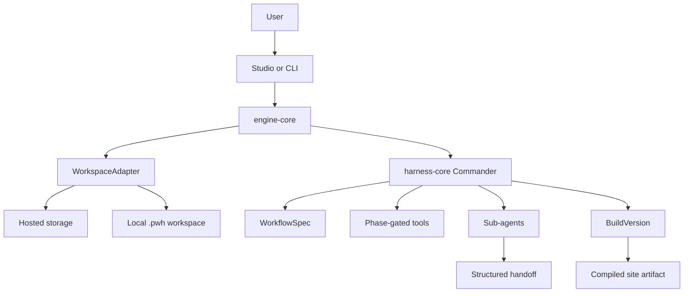

# Personal Wiki Harness Master Plan

This document is the planning anchor for the project. It describes the architecture, workflow, agent topology, implementation plan, and documentation map.

## 1. Product Definition

Personal Wiki Harness is a user-facing platform and local CLI for building personal websites from a maintained personal wiki.

The core product thesis:

- raw sources are immutable evidence
- the personal wiki is the durable source of meaning
- the website is a compiled artifact
- the harness coordinates intent, context, tools, plans, execution, verification, versioning, and reflection

The user should experience this as a simple website-building platform. They should not need to know about harness internals, commander phases, tool records, or mutation plans.

## 2. Surfaces

The project has two product surfaces over the same core engine.

### Studio

`apps/studio` is the hosted GUI platform.

It should provide:

- login and account management
- isolated knowledge bases
- a create page based on conversation
- a knowledge base page for uploaded/managed sources
- a site page for generated websites and versions
- admin views for operational visibility

Studio must hide the word "harness" from normal users. The user-facing language should be about knowledge bases, sites, drafts, versions, and publishing.

### CLI

`apps/cli` is the local-first interface.

It should provide:

- reference-only local source linking
- `.pwh/` workspace creation
- wiki ingest and maintenance
- mutation plan review
- static site export
- audit and verification commands

The CLI is both a local product surface and a test harness for engine correctness.

## 3. Package Architecture

```txt
apps/
  studio/                 Hosted GUI platform
  cli/                    Local CLI over the same engine

packages/
  wiki-core/              Source, wiki, ontology, mutation, lint data model
  engine-core/            Shared GUI/CLI engine boundary and workspace adapters
  harness-core/           Commander, workflow, run state, plans, versions
  agent-runtime/          Model/tool contracts, routing, sub-agent context packets
  site-compiler/          ContentModel, SitePlan, SectionSpec
  meta-skill-core/        System Meta Skill library and promotion policy
```

The intended dependency direction:

```txt
apps/* -> engine-core -> harness-core
engine-core -> wiki-core
harness-core -> agent-runtime
harness-core -> site-compiler
harness-core -> meta-skill-core
```

No app should own build logic that cannot be reused by the other app.

## 4. Runtime Architecture



The commander owns phase transitions. Sub-agents do bounded work inside phases and return structured handoffs.

## 5. Workflow Spec

The workflow spec is the harness runtime rulebook. It defines phases, required inputs, allowed tools, required outputs, exit conditions, and confirmation gates.

The first implementation should live in:

```txt
docs/workflow.md
packages/harness-core/src/workflow.ts
```

`docs/workflow.md` is the readable contract. `workflow.ts` is the typed runtime contract.

### Canonical Phases

```txt
workspace-discovery
knowledge-base-selection
source-linking
ontology-ingest
mutation-plan-review
wiki-maintenance
intent-clarification
site-planning
site-building
verification
versioning
reflection
```

### Example Phase Contract

```ts
{
  id: "mutation-plan-review",
  requiredInputs: ["wikiMutationPlan"],
  allowedTools: ["reviewPlan", "handoffPlan"],
  requiredOutputs: ["planReview", "planHandoff"],
  requiresHumanConfirmation: true,
  canExitWhen: ["planReview.decision !== 'blocked'"]
}
```

The same spec should drive Studio, CLI, and future model commander behavior.

## 6. Commander And Sub-Agents

The first complete runtime should use one commander and five sub-agents.

Commander is not a sub-agent. Commander is the control layer.

```txt
Commander
  - reads WorkflowSpec
  - tracks current phase
  - gates tools
  - delegates bounded work
  - receives handoffs
  - decides continue / pause / fail / ask user

Sub-agents
  - Wiki Curator
  - Intent Analyst
  - Site Planner
  - Site Builder
  - Verifier
```

### Wiki Curator

Owns knowledge maintenance.

Phases:

- source-linking
- ontology-ingest
- mutation-plan-review
- wiki-maintenance

Outputs:

- `WikiMutationPlan`
- ontology candidates
- `planReview`
- `planHandoff`
- updated wiki snapshot after apply

### Intent Analyst

Owns user intent clarification.

Phases:

- intent-clarification

Outputs:

- site type
- audience
- goal
- style
- memory point
- sections
- hard constraints
- soft constraints

### Site Planner

Turns wiki and intent into site structure.

Phases:

- site-planning

Outputs:

- `ContentModel`
- `SitePlan`
- route list
- section specs
- navigation

### Site Builder

Builds the website artifact.

Phases:

- site-building

Outputs:

- static HTML or app route artifact
- preview artifact
- change summary
- version candidate

### Verifier

Checks correctness before completion.

Phases:

- verification

Outputs:

- deterministic checks
- lint issues
- verification report
- block/pass decision

## 7. Context And Handoff Discipline

Sub-agents must not receive the full conversation by default.

They receive a bounded `ContextPacket`:

```txt
goal
phase
allowed tools
hard constraints
soft constraints
selected knowledgeBaseId
wiki refs
source refs
artifact refs
previous handoff refs
output contract
```

They return:

```txt
summary
decisions
artifacts
evidenceRefs
artifactRefs
mustCarryForwardRefs
contextDeltas
toolCalls
```

Summaries may be lossy. References must not be lossy.

The current `handoff-plan` work is the first concrete implementation of this rule.

## 8. Core Data Flow

```mermaid
flowchart LR
  A["Raw Source"] --> B["SourceDocument"]
  B --> C["WikiMutationPlan"]
  C --> D["Review"]
  D --> E["Handoff"]
  E --> F["Apply Plan"]
  F --> G["WikiSnapshot"]
  G --> H["BuildIntent"]
  H --> I["HarnessRun"]
  I --> J["ContentModel + SitePlan"]
  J --> K["Verification"]
  K --> L["BuildVersion"]
  L --> M["SiteWorkspace + SiteGraph"]
  M --> N["Site Artifact"]
```



For ongoing conversational editing, a revision run starts from the previous `BuildVersion`, reads its `SiteGraph`, creates a bounded `PatchPlan`, and writes a new child version. This keeps confirmed structure, source grounding, and style decisions stable across edits. The detailed contract is in `site-workspace-patch-build.md`.

## 9. Local Workspace Shape

The local CLI owns `.pwh/`.

```txt
.pwh/
  workspace.json
  events.jsonl
  plans/
    mutation_*.json
  wiki/
    index.wiki
    log.wiki
    snapshot.json
    sources/
  cache/
    excerpts/
    extracted-text/
  builds/
  dist/
```

Raw files stay in place by default. `.pwh/` stores references, derived wiki state, plans, build artifacts, and event logs.

## 10. Hosted Platform Shape

Studio should eventually persist the same objects with multi-tenant isolation:

```txt
User
  Workspace
    KnowledgeBase
      SourceDocument
      WikiSnapshot
      WikiMutationPlan
      WikiEvent
    HarnessRun
      ContextLedger
      HarnessPlan
      ToolCallRecord
      BuildVersion
        SiteWorkspace
        SiteGraph
        PatchPlan
    Site
      PublishedVersion
```

Every object needs ownership fields:

- `userId`
- `workspaceId`
- `knowledgeBaseId`
- `runId`
- `versionId`

Studio cannot share mutable state across users or knowledge bases.

Current local Studio persistence is a file-backed adapter under `.pwh-studio/`:

```txt
.pwh-studio/
  users.json
  state.json
```

`users.json` stores local account records with hashed passwords. `state.json` stores per-user knowledge runtimes, pending mutation reviews, harness runs, published versions, and site state. This keeps the prototype restart-safe while preserving the hosted database shape above.

## 11. Tool Gating

Tools should be visible by phase, not globally.

```txt
workspace-discovery:
  readManifest

knowledge-base-selection:
  listKnowledgeBases
  readKnowledgeBaseSummary

source-linking:
  linkSource
  readManifest

ontology-ingest:
  readSource
  createMutationPlan

mutation-plan-review:
  reviewPlan
  handoffPlan

wiki-maintenance:
  applyPlan

intent-clarification:
  readWikiIndex
  searchWiki

site-planning:
  readWikiPage
  createSitePlan

site-building:
  compileSite
  writeSiteArtifact

verification:
  verifyWiki
  verifySite
  lintWiki
  auditWorkspace

versioning:
  writeBuildVersion
  publishVersion

reflection:
  recordReflection
  collectSystemSkillEvidence
```

This keeps hard constraints in the environment instead of relying only on prompts.

## 12. Model Routing

Model routing should be role-based and phase-aware.

```txt
Commander: strong
Wiki Curator: strong or balanced
Intent Analyst: balanced or small
Site Planner: strong or balanced
Site Builder: balanced or small with verifier gate
Verifier: deterministic checks first, strong model when inferential review is needed
Reflection/System Meta Skill: strong
Search/Summarization: small or retrieval
```

Strong models should spend judgment where decisions compound. Cheaper models can do bounded execution when verification is available.

## 13. Verification And Audit

Verification must become a completion gate.

First deterministic checks:

- a knowledge base is selected
- knowledge base boundaries were not crossed
- raw sources were not mutated
- mutation plans were reviewed before apply
- source/page/entity refs are preserved
- generated site has a version record
- preview appears only after build
- publish requires explicit user action
- workflow events use tools allowed by their workflow phase

Current commands:

```sh
pwh verify --workspace .
pwh audit --workspace .
```

The audit scorecard should check workflow health, package exports, CLI commands, event logs, verifier coverage, model routing, and graphify freshness.

## 14. Event Log

The local CLI writes append-only workspace events.

```txt
.pwh/events.jsonl
```

Important event kinds:

- workspace.created
- source.linked
- source.extracted
- mutation-plan.created
- mutation-plan.reviewed
- mutation-plan.handoff-created
- mutation-plan.applied
- intent.updated
- site-plan.created
- site.build-started
- site.build-completed
- verification.completed
- audit.completed
- version.created
- site.published
- reflection.recorded

`snapshot.json` is the current state. `events.jsonl` explains how the state happened.

## 15. Implementation Plan

### Milestone 1: Workflow And Event Backbone

- add `docs/workflow.md`
- add `packages/harness-core/src/workflow.ts`
- add workflow phase types
- add phase-gated tool contracts
- add `.pwh/events.jsonl`
- record CLI events for current commands

### Milestone 2: Verification Backbone

- add verifier types
- add deterministic wiki checks
- add deterministic site checks
- add `pwh verify`
- add `pwh audit`
- block build completion when hard checks fail

### Milestone 3: Commander Runtime

- add `Commander` object in `harness-core`
- use `WorkflowSpec` to choose next phase
- create `ContextPacket` per delegated task
- consume `handoff-plan` style outputs
- record commander decisions in `HarnessRun`

### Milestone 4: Model-Backed Wiki Curator

- replace heuristic ontology extraction behind the same `WikiMutationPlan` contract
- return candidates with evidence refs
- keep low-confidence candidates behind review boundaries
- add model-routing controls for wiki curator

### Milestone 5: Studio Engine Integration

- route Studio create flow through engine/harness contracts
- persist knowledge bases by user
- expose plan/review/handoff internally
- keep public UI simple
- show preview only after build
- support revision from existing version

### Milestone 6: Versioning And Publishing

- version graph
- rollback
- draft vs published state
- explicit publish
- per-site history
- user-facing version comparison

### Milestone 7: System Meta Skill Loop

- collect reflection evidence
- separate user preference from system-level lesson
- promote only high-confidence system lessons
- add audit checks for skill bypass

## 16. Documentation Map

```txt
docs/
  README.md                    Documentation entry point
  master-plan.md               This full planning document
  architecture.md              Core architecture thesis and package boundaries
  architecture-flow.html       Visual architecture and flow diagram
  development-roadmap.md       Implementation order and hard/soft constraints
  workflow.md                  Workflow spec, phase rules, tool gates
  events.md                    Append-only workspace event log
  harness-runtime.md           Runtime loop, commander, model tiers, handoffs
  agent-runtime.md             Model adapter and sub-agent execution boundary
  build-state-machine.md       Run state machine
  wiki-model.md                Source/wiki/entity/relation/lint model
  local-workspace.md           Local `.pwh/` workspace design
  ontology-and-commander.md    Ontology extraction and commander pacing
  model-routing.md             Model tier policy
  system-meta-skill.md         System-level reusable procedure layer
```

`workflow.md` now has the readable contract. `packages/harness-core/src/workflow.ts` has the typed runtime contract.

## 17. Current Status

Implemented:

- clean monorepo structure
- Studio GUI skeleton
- local CLI
- `.pwh/` workspace
- source references
- wiki snapshot files
- mutation plan creation
- plan review
- plan handoff with refs
- plan apply
- workflow spec document
- typed workflow runtime contract
- harness plan generation from workflow phases
- event log type
- local `.pwh/events.jsonl`
- CLI event recording
- verifier/audit types
- deterministic verify checks
- deterministic audit checks
- `pwh verify`
- `pwh audit`
- workflow phase/tool gates on workspace events
- pre-build and pre-version hard failure blocking in `pwh build`
- minimal build artifact generation
- model routing types
- system meta skill types
- sub-agent context packet types
- Commander object
- deterministic sub-agent dispatch skeleton
- bounded ContextPacket generation per delegated phase
- run-level commander decisions and sub-agent traces
- dry-run sub-agent executor
- model-backed sub-agent executor contract
- OpenAI-compatible AgentRuntime adapter
- engine-level subAgentExecutor injection
- structured `content-model` artifact consumption
- structured `site-plan` artifact consumption
- lint warnings for unknown model-provided refs
- `ontology-extraction` artifact kind
- model-backed wiki-curator packet for ontology ingest
- sanitized wiki-curator ontology artifacts entering `WikiMutationPlan`
- mutation-plan review gate for model-backed ontology candidates
- ontology curator smoke test
- OpenAI-compatible sub-agent executor convenience wrapper
- source-document read tool registry for ontology ingest batches
- CLI `pwh ingest --model-curator` opt-in path
- Studio `PWH_WIKI_CURATOR_ENABLED` opt-in path for uploaded source ingest
- Studio mutation-plan review surface for model-backed source ingest
- Studio approve / reject / edit-and-reanalyze actions before durable wiki apply
- Studio local user persistence under `.pwh-studio/users.json`
- Studio per-user workspace persistence under `.pwh-studio/state.json`
- per-user isolation for knowledge bases, create-agent context, runs, publishing, and site state
- Studio smoke test for knowledge isolation, build, publish, second edit, parent version, and persisted state
- user-facing version history now shows the parent version and revision summary
- `RunContextManifest` records shared wiki/source/design/design-asset/tool/style refs for every harness run
- every sub-agent `ContextPacket` now carries manifest, design system, design asset registry, tool registry, and style guide inputs
- `mustCarryForwardRefs` automatically preserves shared refs across sub-agent handoffs
- orchestrator handoff verification records lint issues when shared packet context or required refs are missing
- role-based sub-agent executor hook for model tier routing
- Studio `PWH_SITE_AGENTS_ENABLED` opt-in path for model-backed Site Planner and Site Builder roles
- Studio site-planning tool registry for reading/searching the selected wiki and staging site plans
- Site Builder receives prior planning artifacts as structured context, not as lossy chat memory
- `BuildVersion` can retain sanitized `siteArtifact` output from model-backed Site Builder
- deterministic site artifact verifier blocks missing model artifacts, malformed HTML, and internal system-language leaks before versioning
- admin overview shows non-secret model runtime state for create chat, wiki curator, site planner, and site builder
- centralized Studio LLM client routes use cases to primary, economy, or image providers without exposing API keys
- low-cost endpoint was verified for model listing and chat completion; `Kimi-K2.5-low` is usable for bounded cheap tasks

Not complete:

- production model-backed sub-agent policies
- image generation UI/API integration
- production hosted database adapter
- production-grade site compiler

## 18. Next Development Step

The next coding step should be:

```txt
surface build lint issues in Studio draft previews and add one-click revise-from-lint actions
```
