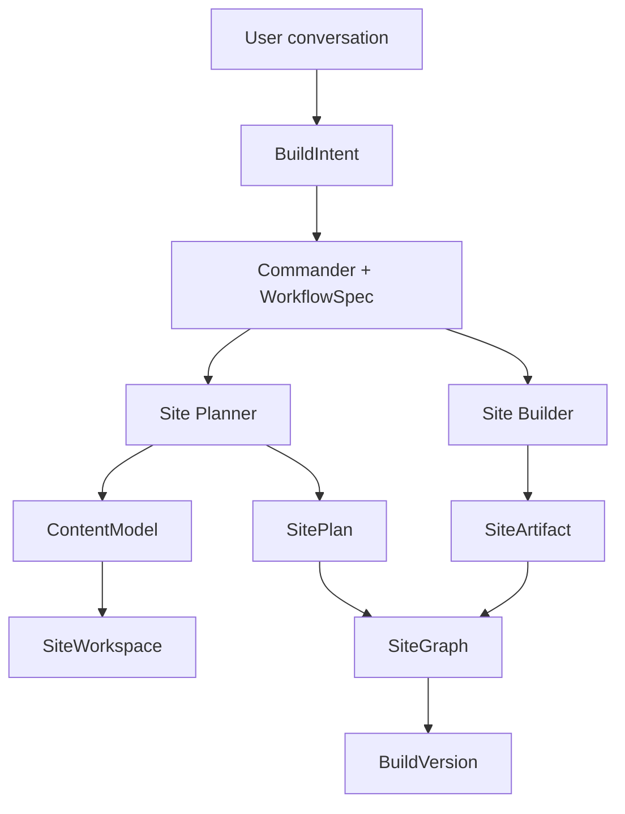
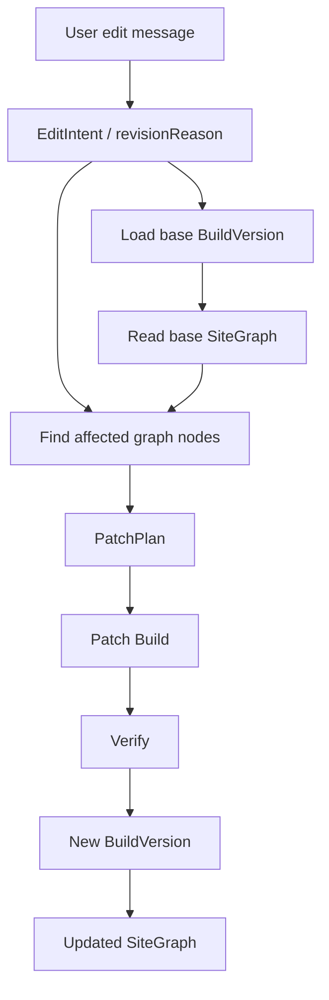

# Site Workspace, Site Graph, And Patch Build

This document defines how Personal Wiki Harness keeps generated websites stable across ongoing conversational editing.

The product rule is:

- the selected wiki remains the source of meaning
- the website is a compiled artifact
- every edit is a patch against a versioned site workspace
- broad regeneration is allowed only when the edit intent requires it

## 1. Problem

A user should be able to keep talking after a website is generated:

- "make the homepage more like a portfolio"
- "move projects before the intro"
- "make it less template-like"
- "rewrite the hero for hiring managers"
- "publish this, then continue editing a new draft"

If each message triggers a full rebuild from conversation memory, the site drifts. Sections disappear, style decisions reset, and source grounding becomes hard to inspect.

The runtime therefore needs a stable editable representation of the generated website.

## 2. Core Objects

### SiteWorkspace

`SiteWorkspace` is the version-scoped boundary for one generated website.

It records:

- `siteId`
- `versionId`
- selected knowledge base
- base version, when revising
- artifact path
- graph id

The current storage path convention is:

```txt
sites/{siteId}/versions/{versionId}/
```

This can later map to local disk, object storage, Git worktrees, or deployment bundles.

### SiteGraph

`SiteGraph` is a lightweight product graph, not a full code graph.

It records relationships between:

- site
- version
- routes
- navigation items
- sections
- content blocks
- components
- design assets
- artifact files
- wiki pages
- wiki entities

Important edge kinds:

- `contains`
- `renders`
- `uses`
- `grounded-in`
- `navigates-to`
- `generates`
- `revises`

This lets the editing agent answer questions like:

- Which section contains the project story?
- Which wiki page grounds this section?
- Which artifact file was generated by this version?
- Which nodes should remain stable during this edit?

### PatchPlan

`PatchPlan` is created when a build has a `baseVersionId` and `revisionReason`.

It records:

- user edit request
- base version
- target version
- affected graph nodes
- preserved graph nodes
- patch steps
- constraints for the edit

The first implementation creates deterministic patch plans from graph differences and request hints. Later, a planner sub-agent can refine this using tools.

## 3. Initial Build Flow



Initial build creates:

- `ContentModel`
- `SitePlan`
- `SiteArtifact`
- `SiteWorkspace`
- `SiteGraph`
- `BuildVersion`

No `PatchPlan` is created for the first version.

## 4. Conversational Editing Flow



The important shift is that the edit starts from the previous `BuildVersion`, not from free-form chat memory.

## 5. Stability Rules

Hard constraints:

- Keep the selected knowledge base isolated.
- Preserve version lineage.
- Do not expose internal harness, agent, model, context packet, or graph language in generated user-facing pages.
- Preserve unaffected graph nodes unless the user explicitly asks for broad redesign.
- Always create a new version instead of mutating the published version in place.

Soft constraints:

- Prefer local patch changes over full regeneration.
- Keep confirmed audience, style, and site type stable.
- Keep navigation stable unless the edit touches page/section structure.
- Reuse chosen design assets/components when they still fit the request.

## 6. When To Use Code Graph / Graphify

`SiteGraph` is always created because it is product-level state.

`graphify` or a similar code graph should be optional and used when:

- a site becomes multi-file or component-heavy
- custom code is generated
- many edits have accumulated
- the verifier detects hard-to-localize failures
- the user enters an advanced/code editing mode
- pre-publish audit needs deeper code navigation

The intended layering:

```txt
SiteGraph     product meaning, source grounding, patch scope
CodeGraph     implementation structure, imports, component/code paths
Graphify      optional implementation for CodeGraph on complex sites
```

## 7. Current Implementation

The current runtime adds these fields to every build version:

```ts
BuildVersion {
  siteWorkspace?: SiteWorkspace
  siteGraph?: SiteGraph
  patchPlan?: PatchPlan
}
```

The first version receives `siteWorkspace` and `siteGraph`.

Revision builds receive:

- `parentVersionId`
- `changeSummary`
- `siteWorkspace`
- `siteGraph`
- `patchPlan`

The patch plan is currently deterministic. It compares base and target graphs and uses simple request hints such as project, homepage, style, copy, and navigation.

## 8. Next Runtime Requirements

### Studio

- Surface version history with parent/child lineage.
- Show which version is currently being edited.
- Store the active draft separately from the published version.
- Keep chat messages attached to the draft version.
- Let users publish a draft without destroying the edit chain.

### Site Builder

- Consume `PatchPlan` during revisions.
- Preserve unaffected sections/components.
- Rebuild only affected artifact files when possible.
- Record graph nodes that were changed, added, removed, or preserved.

### Verifier

- Check graph grounding for generated copy.
- Check navigation edges.
- Check orphan sections and unused artifact files.
- Check whether patch scope matches the user request.
- Warn when a small edit caused a large graph diff.

### Future Code Graph

- Add `CodeGraph` only for complex/generated-code sites.
- Use graphify as an adapter, not as the default product graph.
- Store code graph refs under the same `SiteWorkspace`.

## 9. Acceptance Criteria

The feature is usable when:

- every generated version has a `siteWorkspace`
- every generated version has a `siteGraph`
- every revision has a `patchPlan`
- the UI can distinguish initial builds from revision builds
- published versions are immutable
- continuing edits create new versions
- the verifier can inspect graph-level grounding and patch scope
